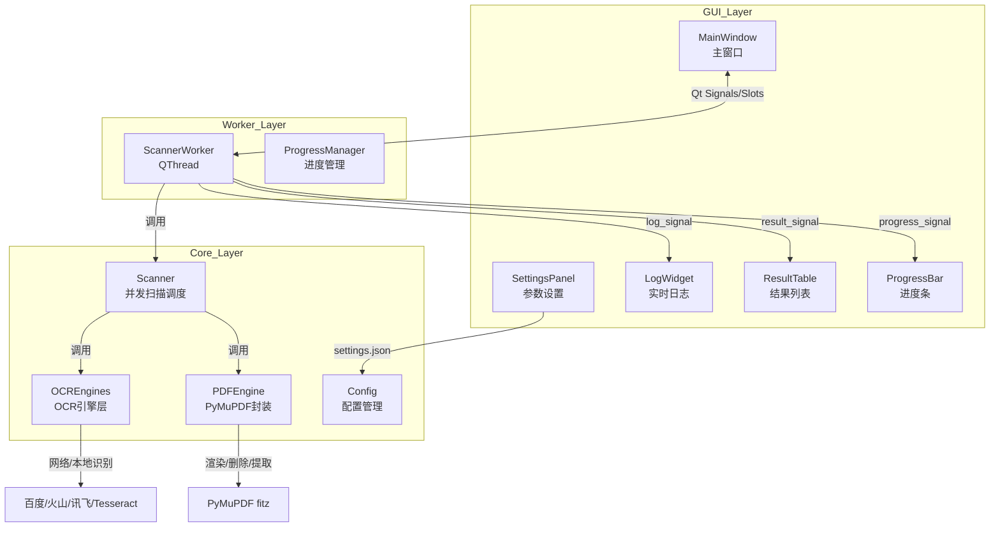

## 产品概述

PDF 版权页扫描与清理桌面软件。通过 OCR 识别 PDF 中的版权关键词，自动删除版权页和空白页，并提供图形界面操作。

## 核心功能

- OCR 扫描指定页面范围，检测版权关键词（支持百度/火山/讯飞/本地 Tesseract）
- 支持 AND/OR 搜索逻辑、模糊匹配、大小写控制
- 自动删除检测到的版权页和空白页
- 断点续扫（进度持久化到 JSON）
- 文件备份机制
- **GUI 参数设置**：源目录选择、备份目录、关键词编辑、页面范围、OCR 模式、DPI、并发数等
- **实时日志显示区域**：带颜色区分的运行日志（信息/警告/错误）
- **扫描结果列表**：表格展示每个文件的处理状态（已修改/未修改/失败）及详情
- **暂停/继续扫描**：扫描过程中可随时暂停，恢复后从当前位置继续
- **进度显示**：总进度条 + 当前文件信息
- 单文件 exe 打包，无外部依赖（无需 poppler）

## Tech Stack

- **Python 3.9+**
- **PyMuPDF (fitz)**：统一替代 PyPDF2 + pdf2image + poppler，负责 PDF 渲染、页面删除、文本提取
- **Pillow**：图像格式转换（PyMuPDF Pixmap -> PIL Image 供 OCR 使用）
- **PySide6**：跨平台桌面 GUI 框架
- **pydantic-settings**：配置管理，支持 `.env` 环境变量与 JSON 配置文件
- **concurrent.futures + threading**：多线程并发扫描 + 暂停信号控制
- **PyInstaller**：打包为单文件 exe，隐藏控制台窗口

## Implementation Approach

### 总体策略

以 PyMuPDF 为唯一 PDF 底层库，彻底移除 PyPDF2 和 pdf2image/poppler 的外部依赖。将原有分散在 3 个文件中的重复逻辑抽取为公共核心模块。使用 PySide6 构建现代桌面 GUI，扫描核心运行在独立 QThread 中，通过 Qt 信号槽与界面实时通信。最终通过 PyInstaller 打包为单文件 exe。

### 关键技术决策

1. **PyMuPDF 统一替换**

- 页面渲染：`Page.get_pixmap(dpi=...).pil_image()` 直接输出 PIL Image，无需外部 poppler，渲染速度提升 3-5 倍
- 页面删除：`Document.delete_page()` 原地或另存为，替代 PyPDF2 的读写流程
- 文本提取：`Page.get_text()` 替代 PyPDF2.extract_text()，稳定性更好
- 空白页检测：基于 PyMuPDF 文本提取，保持原有判断逻辑

2. **并发模型**

- 文件级并发：`ThreadPoolExecutor` 并行处理多个 PDF
- 页面级并发：同一 PDF 的多个待检查页面 OCR 识别并行执行（受 `ocr_max_workers` 限制）
- OCR 网络请求是主要瓶颈，并发可显著缩短总耗时

3. **GUI 与扫描核心通信**

- Scanner 继承 `QThread`，在后台执行避免阻塞 UI
- 自定义 Qt 信号：`log_signal(str, str)` 日志级别+内容、`progress_signal(int, int)` 当前/总数、`result_signal(dict)` 单行结果、`status_signal(str)` 状态变更
- GUI 通过按钮控制 Scanner 的 `pause_event`（threading.Event）实现暂停/继续

4. **Scanner 暂停/继续机制**

- 使用 `threading.Event` 作为暂停信号，在 `process_pdf` 的每个文件处理前和 OCR 调用间隙检查 `is_set()`
- 暂停时保存当前文件索引到内存，恢复后从该索引继续
- 取消扫描通过设置 `cancel_event`，Scanner 安全退出并保存当前进度

5. **配置外置化**

- 使用 `pydantic-settings` 从 `.env` 文件和环境变量读取敏感配置（API 密钥）
- 非敏感配置（关键词、页面范围、DPI）通过 GUI 设置面板保存到 `settings.json`
- 完全移除代码中的硬编码密钥和绝对路径

6. **PyInstaller 单文件打包**

- 使用 `--onefile --noconsole` 参数打包为无控制台窗口的单 exe
- 通过 `sys._MEIPASS` 处理运行时临时资源路径
- 将 `settings.json` 和 `pdf_scan_progress.json` 放在用户数据目录（`%APPDATA%/PDFScanner`）而非 exe 同级，避免权限问题

### 性能与可靠性

- 消除 poppler 外部依赖，减少环境配置失败率
- 引入指数退避重试机制处理 OCR 网络超时
- 进度保存改为异步批量 + 异常安全回退
- 保留向后兼容的扫描进度 JSON 格式

## Implementation Notes

- **Grounded**：保持原有 OCR 引擎的接口契约和识别行为不变；保留 `pdf_scan_progress.json` 的数据结构，避免用户已有进度丢失
- **Blast radius control**：原 `pdf_scanner.py`、`remove_pdf_blank_pages.py`、`remove_pdf_pages.py` 将被新架构替代，功能完整保留并增强
- **Logging**：统一使用 `logging.getLogger("pdf_scanner")`，日志处理器同时输出到文件和 GUI 信号；OCR 异常保留原有的 `logging.error` + GUI 提示双通道
- **性能**：PyMuPDF 渲染的 `Pixmap` 可直接转 bytes 供百度/讯飞/火山 OCR 使用（跳过 PIL 中转），减少一次图像编码开销；本地 Tesseract 仍需 PIL Image，保留 Image 转换接口

## Architecture Design



## Directory Structure

```
d:/code/a1/
├── core/
│   ├── __init__.py
│   ├── config.py              # [NEW] Pydantic 配置管理。支持 .env / settings.json 双源合并，包含 OCR 密钥、路径、扫描参数的定义与校验
│   ├── pdf_engine.py          # [NEW] PDF 统一引擎。基于 PyMuPDF 实现：页面渲染转 PIL Image、页面删除（原地/另存）、文本提取、空白页检测、页面范围字符串解析
│   ├── ocr_engines.py         # [NEW] OCR 引擎集合。从原 pdf_scanner.py 提取的 Local/Baidu/Volc/Iflytek 引擎 + OCREngineFactory，保持原有识别行为
│   ├── scanner.py             # [NEW] 并发扫描器核心。支持 ThreadPoolExecutor 多文件并行、同文件多页面 OCR 并发、结果汇总、进度保存
│   └── models.py              # [NEW] 数据模型。ScanResult 等 dataclass 定义
├── gui/
│   ├── __init__.py
│   ├── main_window.py         # [NEW] 主窗口。整合所有子组件，绑定信号槽，窗口布局管理
│   ├── log_widget.py          # [NEW] 日志显示组件。带颜色区分的 QTextEdit，支持不同级别日志颜色渲染
│   ├── result_table.py        # [NEW] 结果列表组件。QTableView + 自定义模型，展示文件名/状态/页数变化/详情
│   ├── settings_panel.py      # [NEW] 设置面板组件。目录选择器、关键词编辑、页面范围输入、OCR 模式下拉框等
│   └── scanner_worker.py      # [NEW] Scanner 工作线程。继承 QThread，包装 core.scanner，发射 Qt 信号与 GUI 通信，管理暂停/取消状态
├── main.py                    # [NEW] 程序入口。初始化 QApplication、加载样式、创建 MainWindow
├── build.py                   # [NEW] PyInstaller 打包脚本。onefile + noconsole 配置，资源文件处理
├── pdf_scanner.py             # [DELETE] 功能已合并至 core/ + gui/
├── remove_pdf_blank_pages.py  # [DELETE] 功能已合并至 core/pdf_engine.py
├── remove_pdf_pages.py        # [DELETE] 功能已合并至 core/pdf_engine.py
├── .env.example               # [NEW] 环境变量模板文件，包含 API 密钥占位符
├── requirements.txt           # [NEW] 依赖列表：pymupdf, Pillow, PySide6, pydantic-settings 等
└── PDF_SCANNER_USAGE.md       # [MODIFY] 更新使用文档，说明 GUI 使用方法、配置方式、打包说明
```

## Key Code Structures

```python
# core/models.py
@dataclass
class ScanResult:
    file_name: str
    file_path: Path
    status: Literal["modified", "unmodified", "failed", "skipped"]
    copyright_pages: list[int] = field(default_factory=list)
    blank_pages_removed: int = 0
    message: str = ""

# gui/scanner_worker.py
class ScannerWorker(QThread):
    log_signal = Signal(str, str)      # level, message
    progress_signal = Signal(int, int) # current, total
    result_signal = Signal(object)     # ScanResult
    status_signal = Signal(str)        # running/paused/completed/cancelled
    finished_signal = Signal()

    def __init__(self, config: ScanConfig):
        super().__init__()
        self.config = config
        self.pause_event = threading.Event()
        self.cancel_event = threading.Event()

    def pause(self):
        self.pause_event.set()
        self.status_signal.emit("paused")

    def resume(self):
        self.pause_event.clear()
        self.status_signal.emit("running")

    def cancel(self):
        self.cancel_event.set()

    def run(self):
        scanner = PDFScanner(self.config, pause_event=self.pause_event, cancel_event=self.cancel_event)
        scanner.log_callback = lambda level, msg: self.log_signal.emit(level, msg)
        scanner.progress_callback = lambda cur, tot: self.progress_signal.emit(cur, tot)
        scanner.result_callback = lambda result: self.result_signal.emit(result)
        scanner.run()
        self.finished_signal.emit()
```

## 应用类型

桌面应用程序（Windows），面向文件管理/批量处理场景。

## 设计风格

采用现代简洁的工业工具风格，类似 Adobe 或专业批处理软件的界面质感：

- 以深蓝灰（#1E293B）为主背景色，搭配高对比度的功能区色彩
- 使用卡片式布局分隔不同功能区域
- 按钮和输入框采用圆角现代设计
- 整体界面紧凑高效，适合长时间操作

## 页面/窗口规划

由于是桌面工具软件，核心为一个主窗口，内部划分为多个功能区块：

### 主窗口布局（从上到下）

1. **标题栏与工具栏**：软件名称 + 版本号 + 最小化/最大化/关闭按钮
2. **参数设置面板（SettingsPanel）**：

- 左侧：源目录选择（带浏览按钮）、备份目录选择
- 中间：关键词输入（支持多行/逗号分隔）、页面范围输入、OCR 模式下拉框
- 右侧：DPI 设置、并发数设置、搜索逻辑（AND/OR）、勾选框（删除版权页/删除空白页/调试模式）
- 底部：保存配置 / 加载配置按钮

3. **操作控制栏**：开始扫描 / 暂停 / 继续 / 停止 按钮 + 总进度条 + 当前处理文件名
4. **内容展示区（左右分栏）**：

- 左侧（60%宽度）：实时日志显示区域（带时间戳和颜色区分）
- 右侧（40%宽度）：扫描结果列表（表格：文件名 | 状态 | 页数变化 | 操作时间）

5. **状态栏**：当前状态文本 + 已扫描/已修改/失败 统计数字

### 交互设计

- **开始扫描**：参数面板锁定为只读，按钮切换为「暂停/停止」可用
- **暂停**：扫描线程在文件间隙暂停，按钮切换为「继续/停止」
- **继续**：恢复扫描，从下一个文件开始
- **停止**：立即终止扫描，保存当前进度，解锁参数面板
- **日志区域**：自动滚动到底部，支持右键菜单（复制/清空）
- **结果列表**：支持点击行查看详情，右键导出结果

### 响应式设计

- 主窗口默认尺寸 1200x800，支持最大化
- 左右分栏使用 QSplitter，用户可拖动调整宽度
- 参数面板在窗口缩小时自动换行排列

## Agent Extensions

### SubAgent

- **code-explorer**
- Purpose: 在重构过程中需要跨多个文件验证符号依赖关系、确认 OCR 引擎接口细节和页面范围解析逻辑时，用于批量代码搜索和探索
- Expected outcome: 确保新提取的 ocr_engines.py 和 pdf_engine.py 完整保留原有行为，无遗漏方法或参数